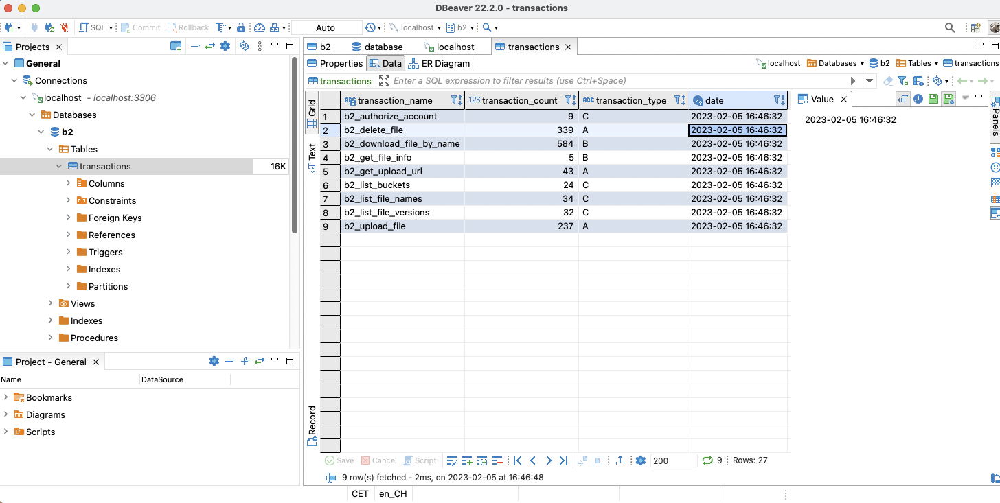

# b2-transaction-tracker

## About The Project

**Track your Backblaze b2 API transactions**.

This is a simple tool built on [selenium](https://selenium-python.readthedocs.io/) to scrape api transaction counts from Backblaze's [b2 cloud-storage](https://www.backblaze.com/b2/cloud-storage.html) reports. Transactions are stored in SQL.

Example:


## Why this exists?

**tl;dr** I was annoyed that Backblaze does not offer the ability to gather your api transactions in an automated way, e.g. through their [b2 cli](https://www.backblaze.com/b2/docs/quick_command_line.html).

Modern backup solutions can backup your data directly to the cloud using the b2 api. This means that deduplication, snapshots and compression can all be performed in your cloud storage blob directly. However, the number of api transactions is non-trivial for sufficiently large backups and calculating the transaction costs with any amount of granularity i.e day to day or hour to hour is not possible currently. In theory you could expose the api transaction calls in your respective backup client but this is messy and prone to mistakes. E.g. it may require re-forking your backup client's codebase every time they perform a major update or having to re-merge everytime they update. Furthermore, the metrics that Backblaze counts are the only ones that really matter since those are the metrics that contribute towards your final bill. So i think it makes more sense to get the data "from the horse's mouth". My wish is that Backblaze implement the ability to pull the api counts from their b2 cli. Backblaze, are you reading this? :)


  * [Getting Started](#getting-started)
    + [1. Clone the repo](#1-clone-the-repo)
    + [2. Create a docker-network](#2-create-a-docker-network)
    + [3. Export your b2 username and password](#3-export-your-b2-username-and-password)
    + [4. Build the b2-transaction-tracker image](#4-build-the-b2-transaction-tracker-image)
    + [5. Modify the docker-compose file](#5-modify-the-docker-compose-file)
    + [6. Run the docker-compose file](#6-run-the-docker-compose-file)
    + [7. Run the b2-transaction-tracker](#7-run-the-b2-transaction-tracker)
  * [Environment Variables](#environment-variables)
  * [Two-factor authentication](#two-factor-authentication)


## Getting Started

### 1. Clone the repo

   ```bash
   git clone https://github.com/oregonpillow/b2-transaction-tracker.git

   cd b2-transaction-tracker
   ```

### 2. Create a docker-network
   ```bash
   docker network create b2
   ```
### 3. Export your b2 username and password

   ```bash
   echo 'export B2_EMAIL="<YOUR EMAIL HERE>"' >> ~/.zshrc

   echo 'export B2_PWD="<YOUR PASSWORD HERE>"' >> ~/.zshrc

   # or replace with your respective shell environment. E.g. for bash ~/.bashrc
   ```


### 4. Build the b2-transaction-tracker image

```bash
 docker build -t b2-transaction-tracker .
```

### 5. Modify the docker-compose file

   Update the following SQL variables in the docker-compose:

   - MYSQL_ROOT_PASSWORD
   - MYSQL_USER
   - MYSQL_PASSWORD

### 6. Run the docker-compose file 

```bash
 docker-compose up -d
```

---

*m1 users: change the selenium image from
'selenium' to 'seleniarm' in the compose file*

---

### 7. Run the b2-transaction-tracker

```bash
docker run \
-e B2_EMAIL \
-e B2_PWD \
-e DB_USER=user \
-e DB_PWD=password \
--network=b2 \
--rm b2-transaction-tracker:latest
```

---

*DB_USER must match MYSQL_USER*

*DB_PWD must match MYSQL_PASSWORD*

---

The container typically takes about 10 seconds to run.

To schedule automatic collection of api transactions I recommend using cron to schedule this container. Be sure your environment variables are sourced correctly if you choose this method.

## Environment Variables

| ENV      | Description | Default |
| ----------- | ----------- | --- |
| B2_EMAIL      | b2 email       | --- |
| B2_PWD   | b2 password        | --- |
| DB_HOST   | name of sql container name        | **b2-db** |
| DB_USER   | sql user, must match MYSQL_USER set in SQL container        | **user** |
| DB_PWD   | sql password, must match MYSQL_PASSWORD set in SQL container        | **password** |
| DB_PORT   | default sql port        | **3306** |
| DB_NAME   | sql database name, must match MYSQL_DATABASE set in SQL container        | **b2** |
| TIMESTAMP   | When set to **TRUE**, SQL date entry includes time as well "2023-01-01 20:30:45" (each entry is unique and kept). When set to **FALSE**, only the date is recorded "2023-02-07 00:00:00", meaning that subsequent runs within same day will overwrite any previous data recorded that day (keeps the latest)       | **TRUE** |
| B2_TOTP      | Backblaze 2FA Generator key (see instructions below)       | --- |


## Two-factor authentication

You can use the tool with 2FA enabled on your Backbaze account. In order to do this, you'll need a copy of your Backblaze TOTP private key. If you already have 2FA enabled on your account, you might need to disable then re-enable it to get this key.

Sign in to https://www.backblaze.com/

   --> My Settings

   --> Security: Sign In Settings

   --> Two-Factor Authentication: "on"

   --> What Authentication Method?: "Authentication Application"

   --> Click the toggle link "Or enter key manually..."

   --> Copy the Key, this is your private key for generating TOTP codes. Set this variable to B2_TOTP.
